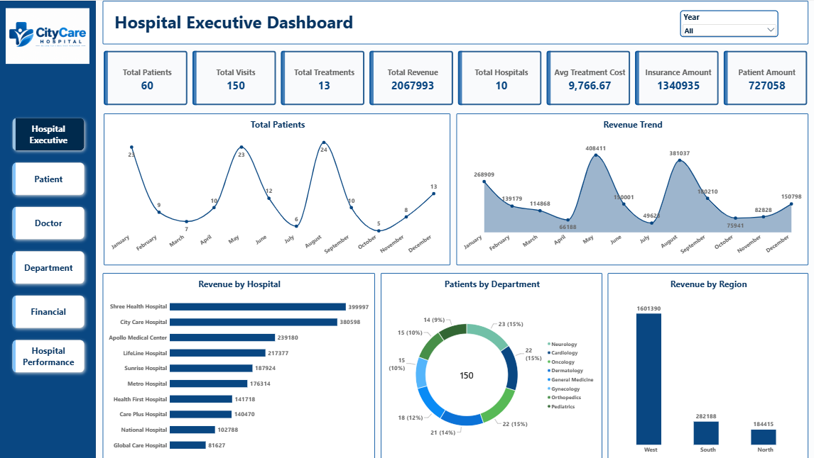
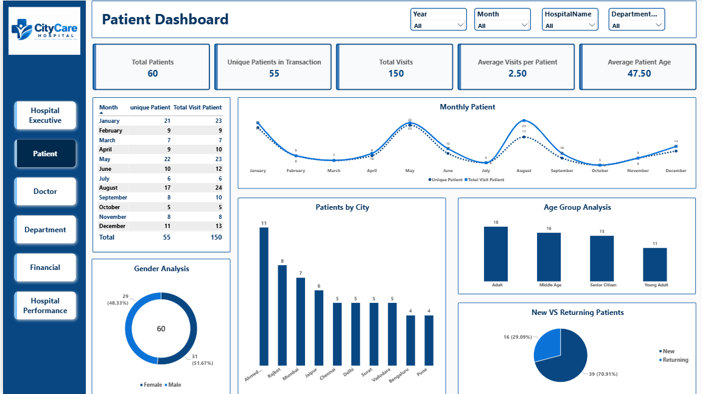
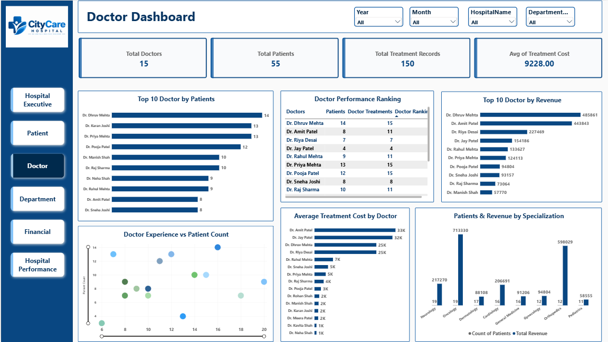
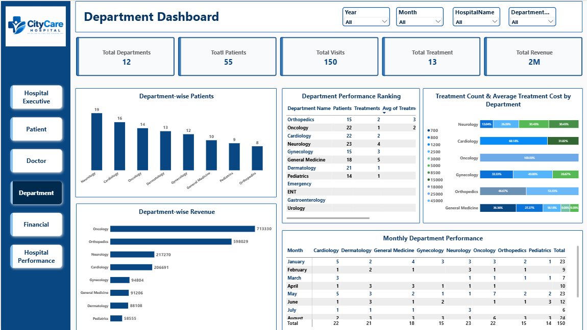
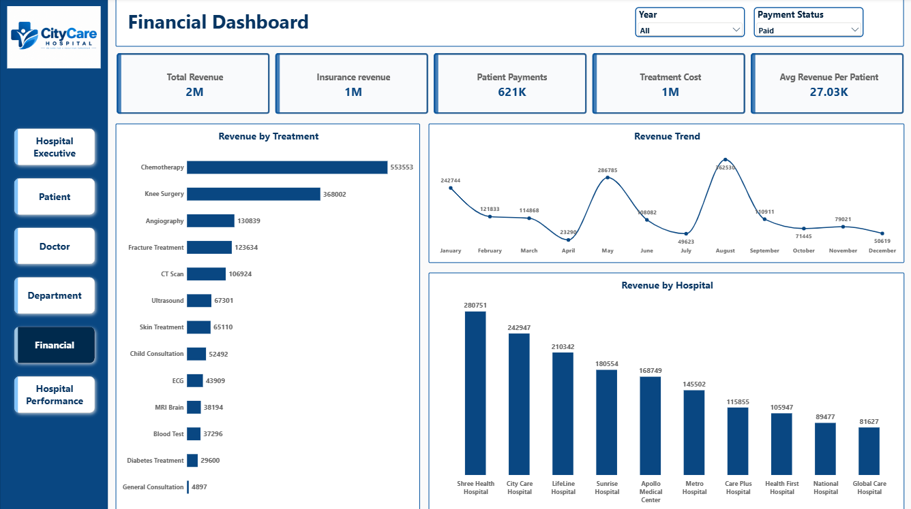
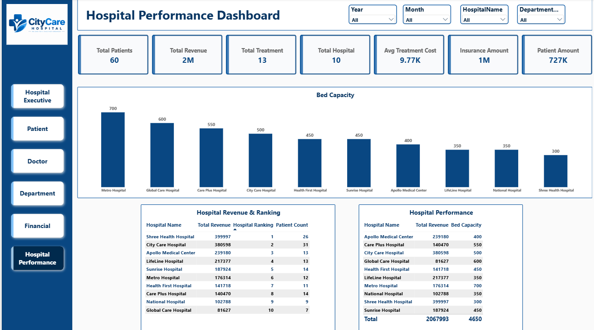

Hospital & Healthcare Analytics — Data Analytics Dashboard

A Power BI data analytics project designed to analyze hospital operations, patient activity, doctor performance, department performance, and financial outcomes through interactive dashboards.

## 📊 Project Overview

This project provides a multi-page view of healthcare data covering patients, visits, treatments, doctors, departments, hospitals, revenue, treatment costs, insurance, and hospital capacity.

The dashboard is designed to help understand healthcare performance from both operational and financial perspectives.

## 🛠️ Tools & Technologies

- **Power BI**
- **Power Query** – Data cleaning and transformation
- **DAX** – Measures and calculated analysis
- **Data Modeling** – Relationships and analytical model
- **Excel / Dataset** – Source data

## 📑 Dashboard Pages

### 1. Hospital Executive Dashboard

Provides a high-level overview of hospital activity and financial performance.

**Key KPIs:**
- Total Patients: 60
- Total Visits: 150
- Total Treatments: 13
- Total Revenue: 2,067,993
- Total Hospitals: 10
- Average Treatment Cost: 9,766.67
- Insurance Amount: 1,340,935
- Patient Amount: 727,058

**Visuals:**
- Total Patients Trend
- Revenue Trend
- Revenue by Hospital
- Patients by Department
- Revenue by Region

---

### 2. Patient Dashboard

Analyzes patient demographics, visit patterns, cities, age groups, gender, and new vs returning patients.

**Key KPIs:**
- Total Patients: 60
- Unique Patients in Transaction: 55
- Total Visits: 150
- Average Visits per Patient: 2.50
- Average Patient Age: 47.50

**Visuals:**
- Monthly Patient Trend
- Unique Patients vs Total Visits
- Patients by City
- Age Group Analysis
- Gender Analysis
- New vs Returning Patients
- Monthly patient summary table

---

### 3. Doctor Dashboard

Analyzes doctor workload, patient count, treatment records, treatment costs, revenue, and performance ranking.

**Key KPIs:**
- Total Doctors: 15
- Total Patients: 55
- Total Treatment Records: 150
- Average Treatment Cost: 9,228.00

**Visuals:**
- Top 10 Doctors by Patients
- Top 10 Doctors by Revenue
- Doctor Performance Ranking
- Average Treatment Cost by Doctor
- Doctor Experience vs Patient Count
- Patients & Revenue by Specialization

---

### 4. Department Dashboard

Provides department-level analysis of patients, treatments, revenue, and monthly performance.

**Key KPIs:**
- Total Departments: 12
- Total Patients: 55
- Total Visits: 150
- Total Treatments: 13
- Total Revenue: 2M

**Visuals:**
- Department-wise Patients
- Department-wise Revenue
- Department Performance Ranking
- Treatment Count & Average Treatment Cost by Department
- Monthly Department Performance

---

### 5. Financial Dashboard

Focuses on hospital revenue, insurance revenue, patient payments, treatment costs, and revenue trends.

**Key KPIs:**
- Total Revenue: 2M
- Insurance Revenue: 1M
- Patient Payments: 621K
- Treatment Cost: 1M
- Average Revenue per Patient: 27.03K

**Visuals:**
- Revenue by Treatment
- Revenue Trend
- Revenue by Hospital

---

### 6. Hospital Performance Dashboard

Analyzes hospital-level revenue, patient count, bed capacity, and overall hospital performance.

**Key KPIs:**
- Total Patients: 60
- Total Revenue: 2M
- Total Treatment: 13
- Total Hospital: 10
- Average Treatment Cost: 9.77K
- Insurance Amount: 1M
- Patient Amount: 727K

**Visuals:**
- Bed Capacity by Hospital
- Hospital Revenue & Ranking
- Hospital Performance Table
- Revenue and capacity comparison

## 🔍 Key Business Questions

This dashboard helps answer questions such as:

- How many patients and visits are recorded?
- What is the monthly patient trend?
- Which hospitals generate higher revenue?
- Which departments handle more patients?
- Which doctors have higher patient counts?
- Which doctors generate higher treatment revenue?
- How does doctor experience relate to patient count?
- Which departments contribute the most revenue?
- What are the major treatment revenue sources?
- How is revenue distributed between insurance and patient payments?
- What is the monthly revenue trend?
- Which hospitals have higher bed capacity?
- How do hospital revenue and patient counts compare?
- Which departments and hospitals require closer performance analysis?

## 📈 Dashboard Features

- Interactive Year filters
- Month, Hospital, and Department filters
- KPI cards for executive monitoring
- Patient demographic analysis
- Doctor performance analysis
- Department performance analysis
- Hospital revenue comparison
- Financial analysis
- Monthly trend analysis
- Hospital ranking
- Bed capacity analysis
- New vs returning patient analysis
- Treatment-level revenue analysis

## 💡 Analytical Areas

### Patient Analytics
Analyzes patient demographics, visit frequency, cities, age groups, gender, and new vs returning patients.

### Doctor Performance
Tracks doctor patient counts, treatment records, revenue, treatment costs, experience, and specialization.

### Department Analysis
Examines department-wise patient volume, treatments, revenue, costs, and monthly performance.

### Financial Analytics
Analyzes revenue, insurance payments, patient payments, treatment costs, and revenue trends.

### Hospital Performance
Compares hospitals using revenue, patient count, ranking, and bed capacity.
